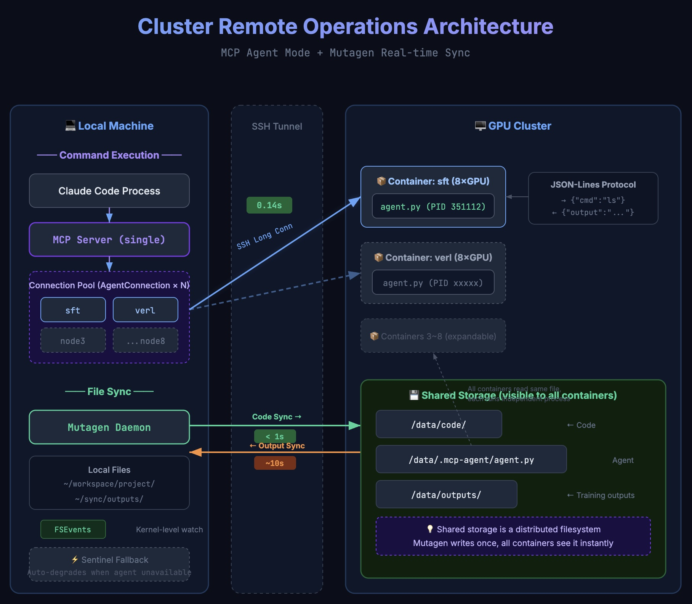

# Robby Cluster Connect


[English](README.md) | 中文

> Claude Code Skill，用于操作 GPU 集群——本地编辑代码，远程执行命令，通过持久 SSH Agent 连接实现 ~0.1s 延迟。

## 安装

```bash
npx skills add git@github.com:jiahao-shao1/robby-cluster-connect.git
```

安装后重启 Claude Code，然后说"连集群"。Claude 会在首次使用时自动引导你完成配置（容器、路径、MCP server 安装）。

## 架构



**两种执行模式** —— Agent 模式快 ~10x，Sentinel 模式为自动降级方案：

| 模式 | 延迟 | 工作原理 |
|------|------|---------|
| **Agent 模式** | ~0.1s | 持久 SSH 连接 → 集群端 `agent.py` → JSON-Lines 协议 |
| **Sentinel 模式** | ~1.5s | 每次新建 SSH → 哨兵模式检测 → `proc.kill()` |

- **代码编辑**：本地 Claude Code 原生工具（~0.5ms）
- **代码同步**：Mutagen 实时同步（推荐，见 [MUTAGEN.md](MUTAGEN.md)）或 git push/pull
- **远程执行**：`remote_bash(node="sft", command="...")` —— 单个 MCP，多节点路由

## 为什么需要这个

GPU 集群通常位于 SSH 代理之后，代理不会在命令结束后关闭连接，导致 `ssh host "cmd"` 永远挂起。这个 Skill 通过哨兵模式检测解决此问题，并通过持久 Agent 连接进一步加速。

## 工作原理

### Agent 模式（快速，~0.1s）

```
MCP Server                          集群容器
┌──────────┐   SSH 长连接           ┌────────────┐
│ AgentConn│── stdin: JSON 请求 ──→│ agent.py   │
│ Pool     │←─ stdout: JSON 响应 ──│ subprocess │
│ (每节点  │                       │ .run(cmd)  │
│  一个)   │                       └────────────┘
└──────────┘
```

每个节点一个 SSH 连接，通过 `ServerAliveInterval` 保活。命令以 JSON-Lines 发送，结果立即返回。

### Sentinel 模式（降级，~1.5s）

```
remote_bash("nvidia-smi")

→ ssh -tt -p 10025 127.0.0.1 'nvidia-smi 2>&1; echo "___MCP_EXIT_${?}___"'

stdout:
  | NVIDIA H20 ...
  ___MCP_EXIT_0___     ← 检测到哨兵

→ proc.kill()          ← 强制终止 SSH（代理不会自动关闭）
→ 返回清理后的输出
```

Agent 不可用时自动使用。

## 文件结构

```
robby-cluster-connect/
├── SKILL.md                          # Skill 指令
├── cluster-agent/
│   └── agent.py                      # 集群端 Agent（零依赖，~100 行）
├── mcp-server/
│   ├── mcp_remote_server.py          # MCP 服务器（Agent 模式 + Sentinel 降级）
│   ├── pyproject.toml                # 依赖：mcp>=1.25
│   └── setup.sh                      # 一键安装脚本（支持多节点 JSON）
├── reference/
│   ├── context.template.md           # 配置模板
│   └── context.local.md              # 个人配置（gitignored，自动生成）
├── MUTAGEN.md                        # Mutagen 实时同步指南
└── docs/
    └── arch-en.jpg                   # 架构图
```

## 配置

Skill 使用两层配置：

1. **用户级**（`reference/context.local.md`）：集群容器、SSH 端口、workstation、GPU 脚本——所有项目共享
2. **项目级**（`<项目>/.claude/cluster-context.md`）：项目路径、mutagen session、同步脚本——每个项目独立

两者均在首次使用时通过交互式问答自动生成。

## 致谢

灵感来自 [claude-code-local-for-vscode](https://github.com/justimyhxu/claude-code-local-for-vscode)。

感谢 [@cherubicXN](https://github.com/cherubicXN) 实现 Mutagen 本地-集群实时同步。

## 许可证

MIT
